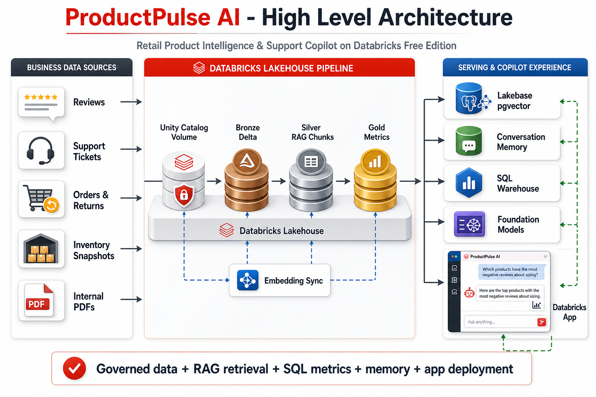
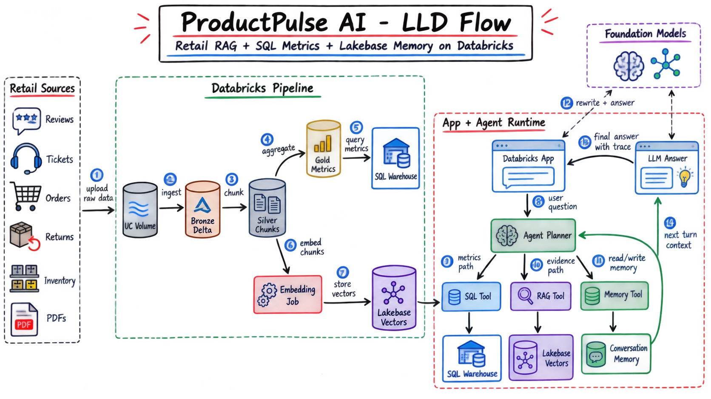
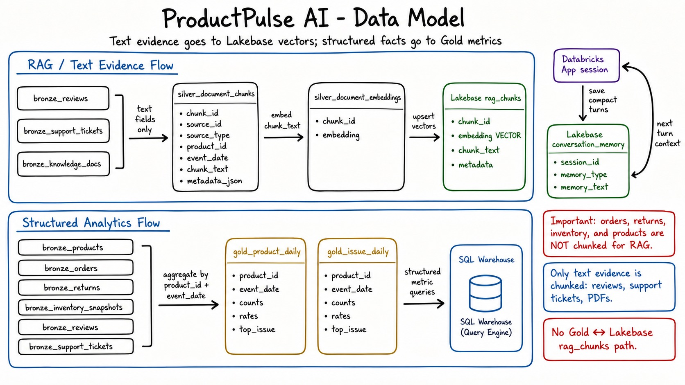
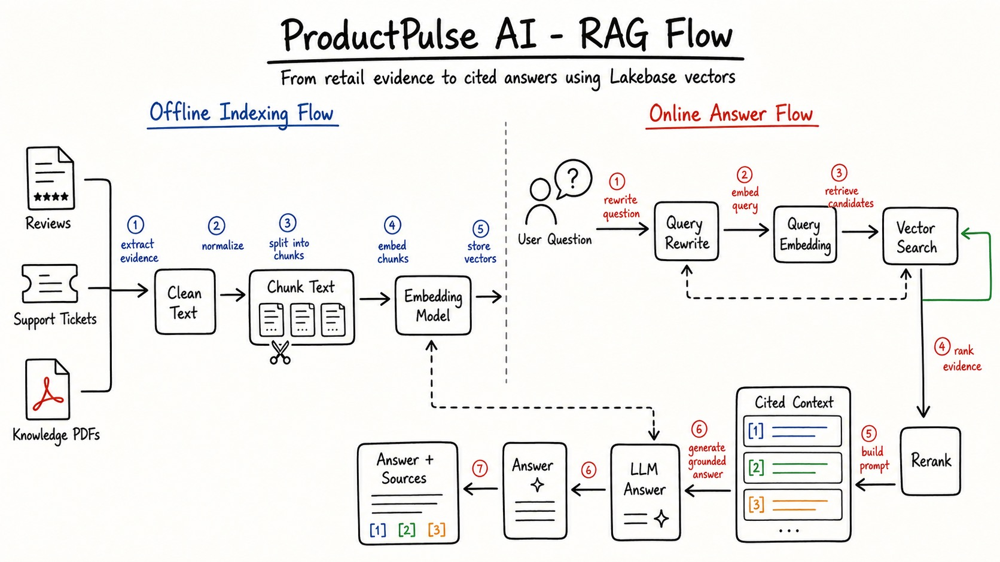
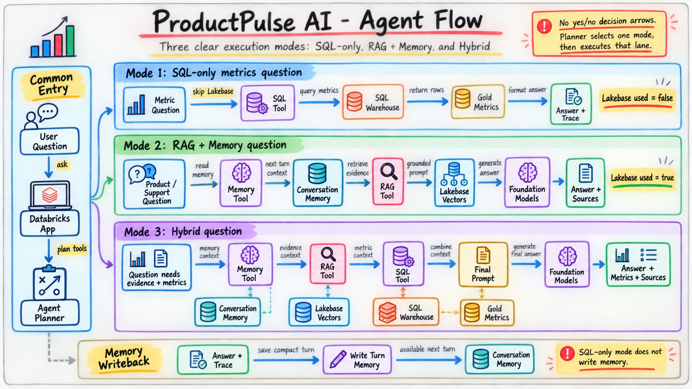

# ProductPulse AI

Adidas-inspired Retail Product Intelligence and Support Copilot on Databricks Free Edition.

ProductPulse AI is an end-to-end Databricks project for a senior data engineering bootcamp. It demonstrates how a retail organization can combine Lakehouse data engineering, RAG, Lakebase vector retrieval, SQL metrics, memory, and Databricks Apps into one working conversational product intelligence system.

The use case is inspired by real retail product feedback and support analytics patterns. All products, reviews, tickets, returns, orders, inventory snapshots, and PDF documents in this repository are synthetic.

## Problem Statement

Retail teams receive product feedback from many places:

- Customer reviews
- Support tickets
- Returns and exchanges
- Product orders
- Inventory availability
- Warranty/QA documents
- Product launch briefs
- Support playbooks

The same product issue may appear in different language across systems.

Example:

```text
Review:       "The toe box feels narrow after 5K."
Ticket:       "Customer wants half-size exchange because toes feel numb."
Return:       "toe_box_narrow"
PDF guidance: "Wide-foot runners should be guided toward a half-size increase."
```

A normal dashboard can show counts, but it cannot explain the evidence. A normal document search can find policy text, but it cannot combine that text with structured return rates, ticket counts, inventory, and previous conversation context.

ProductPulse AI solves this by building a governed data and AI system where:

1. Raw retail data lands in Unity Catalog.
2. Structured feeds are loaded into Bronze Delta tables.
3. Text evidence from reviews, tickets, and PDFs is converted into RAG chunks.
4. Embeddings are generated and synced into Lakebase for vector retrieval.
5. Structured metrics are aggregated into Gold Delta tables.
6. A custom agent decides when to use SQL, RAG, memory, or a hybrid path.
7. A Databricks App exposes the final copilot interface to business users.

## Use Case

The copilot is designed for product, support, category, and operations teams.

Users can ask:

```text
Why are customers returning RUN-ULTRA-01?
```

The agent can answer using:

- Return counts and return rate from Gold tables.
- Review and ticket evidence from Lakebase RAG.
- Product launch guidance from internal PDFs.
- Conversation memory from previous turns.
- Final LLM synthesis with citations and operational next actions.

The goal is not just to build a chatbot. The goal is to show a production-shaped architecture that senior data engineers and architects can discuss:

- Unity Catalog governance
- Delta Lake layered modeling
- PDF ingestion and text extraction
- RAG chunking and embeddings
- Lakebase pgvector retrieval
- Lakebase conversation memory
- SQL Warehouse metric serving
- Agent tool routing
- Databricks Apps deployment

## Business Value

- Product managers can identify repeated fit, quality, content, and warranty signals.
- Support leaders can generate consistent customer handling guidance.
- Category managers can compare product-level return and sentiment patterns.
- Operations teams can use inventory context before recommending exchanges.
- Data teams can demonstrate end-to-end Databricks Free Edition architecture.
- Architects can discuss when to use Delta, Lakebase, SQL Warehouse, and model APIs.

## What We Are Building

ProductPulse AI has five major parts:

| Part | What it does |
| --- | --- |
| Data generator | Creates realistic multi-day synthetic retail data and internal PDF documents. |
| Databricks pipeline | Loads raw files, builds Bronze tables, creates RAG chunks, generates embeddings, syncs Lakebase, and builds Gold metrics. |
| Lakebase serving store | Stores RAG vectors in `rag_chunks` and conversation memory in `conversation_memory`. |
| Custom agent | Routes each question to SQL-only, RAG + memory, or hybrid mode. |
| Databricks App | Provides the Streamlit chat interface for end users. |

## Repository Contents

| Area | Files |
| --- | --- |
| Databricks notebooks | `notebooks/00_setup_unity_catalog.py` through `notebooks/05_manual_agent_demo.py` |
| Agent code | `src/productpulse/agent.py`, `retrieval.py`, `lakebase.py`, `databricks_models.py` |
| Streamlit app | `app/app.py`, `app.yml` |
| Synthetic data | products, orders, returns, inventory snapshots, reviews, support tickets, PDF manifest, and PDFs under `data/raw` |
| Databricks Asset Bundle | `databricks.yml` |
| Lakebase SQL | `sql/01_lakebase_schema.sql` |
| Diagrams | hand-sketched JPG diagrams plus supporting SVG diagrams under `diagrams/` |
| Runbook | `TECHNICAL_RUNBOOK.md` |

## High-Level Architecture



This diagram shows the full system at an executive level.

The left side represents retail source data:

- Reviews
- Support tickets
- Orders and returns
- Inventory snapshots
- Internal PDFs

The middle represents the Databricks Lakehouse:

- Unity Catalog volume for raw data
- Bronze Delta tables for clean raw data
- Silver RAG chunks and embeddings
- Gold metrics for analytics

The right side represents the serving layer:

- Lakebase pgvector for RAG retrieval
- Lakebase memory for conversation context
- SQL Warehouse for structured metrics
- Foundation Models for embeddings and final answers
- Databricks App for the chat interface

Use this diagram when explaining the overall project to a business or architecture audience.

## Low-Level Component Flow



This diagram explains how the system works from an execution-flow perspective.

The flow is:

1. Retail data is generated locally.
2. Data is uploaded into a Unity Catalog volume.
3. The Databricks workflow loads raw files into Bronze.
4. Reviews, tickets, and PDF text are converted into Silver RAG chunks.
5. Silver chunks are embedded and synced to Lakebase vectors.
6. Structured Bronze data is aggregated into Gold metrics.
7. SQL Warehouse serves metric questions from Gold tables.
8. Databricks App sends user questions to the agent.
9. The agent chooses SQL, RAG, memory, or hybrid mode.
10. The answer returns to the app with trace information.

Use this diagram when explaining how project components interact without going into every source file.

## Data Model



This is the most important diagram for understanding the project correctly.

The data model has two separate lanes.

### Lane 1: RAG / Text Evidence Flow

Only text evidence goes into RAG.

These Bronze tables provide text:

```text
bronze_reviews
bronze_support_tickets
bronze_knowledge_docs
```

They produce:

```text
silver_document_chunks
```

Then:

```text
silver_document_chunks
        -> silver_document_embeddings
        -> Lakebase rag_chunks
```

`silver_document_chunks` stores:

```text
chunk_id
source_id
source_type
product_id
event_date
chunk_text
metadata_json
```

`silver_document_embeddings` stores:

```text
chunk_id
embedding
```

Lakebase `rag_chunks` stores:

```text
chunk_id
chunk_text
metadata
embedding VECTOR
```

This is the path used by RAG retrieval.

### Lane 2: Structured Analytics Flow

Structured facts do not get chunked for RAG.

These Bronze tables are used for analytics:

```text
bronze_products
bronze_orders
bronze_returns
bronze_inventory_snapshots
bronze_reviews
bronze_support_tickets
```

They produce:

```text
gold_product_daily
gold_issue_daily
```

Then SQL Warehouse queries those Gold tables.

`gold_product_daily` stores daily product metrics such as:

```text
product_id
event_date
review_count
ticket_count
order_count
units_sold
return_count
return_rate
avg_rating
negative_sentiment_count
return_related_count
on_hand_units
stock_status
top_issue
```

`gold_issue_daily` stores issue-level metrics such as:

```text
product_id
event_date
issue_tag
feedback_count
negative_count
high_priority_ticket_count
```

Important clarification:

- Orders are not chunked.
- Returns are not chunked.
- Inventory snapshots are not chunked.
- Product master rows are not chunked.
- Review text is chunked.
- Support ticket text is chunked.
- PDF text is chunked.
- Gold tables do not feed Lakebase `rag_chunks`.
- Lakebase `rag_chunks` comes from `silver_document_embeddings`.

### Why Reviews And Tickets Appear In Both Lanes

Reviews and tickets are hybrid data.

They contain text:

```text
review_body
ticket_body
```

That text goes to RAG.

They also contain structured fields:

```text
product_id
event_date
sentiment
issue_tag
reason
priority
channel
customer_segment
```

Those fields are used for metrics and metadata.

## RAG Flow



The RAG flow has two phases.

### Offline Indexing Flow

This happens in the Databricks pipeline.

Input sources:

```text
Reviews
Support Tickets
Knowledge PDFs
```

Steps:

1. Extract useful text evidence.
2. Normalize the text into a common schema.
3. Split long PDF text into smaller chunks.
4. Generate embeddings for each chunk.
5. Store vectors in Lakebase `rag_chunks`.

Example:

```text
PDF-RUN-ULTRA-LAUNCH-BRIEF
        -> extracted text
        -> chunk 1, chunk 2, chunk 3...
        -> embeddings
        -> Lakebase rag_chunks
```

### Online Answer Flow

This happens when a user asks a question in the app.

Example question:

```text
Why are customers returning RUN-ULTRA-01?
```

Steps:

1. Rewrite the question into retrieval-friendly wording.
2. Embed the rewritten question.
3. Search Lakebase vectors for similar chunks.
4. Rerank retrieved chunks using vector distance plus keyword overlap.
5. Build cited context blocks like `[1]`, `[2]`, `[3]`.
6. Send context to the LLM.
7. Return an answer with source references.

RAG is used when the answer needs customer language, ticket evidence, PDF guidance, or product-specific explanation.

## Agent Flow



The agent does not follow a confusing yes/no decision tree. It asks the configured Databricks chat model to create a structured JSON tool plan for the current question.

The production-shaped pattern is:

```text
user question
    -> LLM planner
    -> JSON tool plan
    -> Python validation and guardrails
    -> selected tools run
    -> final LLM answer
```

The LLM planner chooses the route, but Python still validates the plan before executing anything. That means:

- SQL-only questions can be forced to skip Lakebase.
- Remember/save instructions can be forced to write durable memory.
- Invalid planner JSON falls back to deterministic routing.
- The app trace shows the final tool plan that was actually executed.

There are four practical modes.

### Mode 1: SQL-Only Metrics Question

Use this when the question only asks for counts, rankings, rates, or trends.

Example:

```text
What are the top products by ticket count?
```

Tool plan:

```text
route = sql_only
read_memory = false
rag_search = false
query_metrics = true
write_memory = false
planner_source = llm_planner
```

What happens:

1. Agent skips Lakebase.
2. Agent queries SQL Warehouse.
3. SQL Warehouse reads Gold metrics.
4. App returns answer and trace.

Lakebase is not used in this mode.

### Mode 2: RAG + Memory Question

Use this when the question needs explanation from customer text, support tickets, or PDFs.

Example:

```text
What should support agents say about narrow toe box complaints?
```

Tool plan:

```text
route = rag_memory
read_memory = true
rag_search = true
query_metrics = false
write_memory = true
planner_source = llm_planner
```

What happens:

1. Agent reads recent memory for the current session.
2. Agent retrieves evidence from Lakebase vectors.
3. Agent builds cited context.
4. LLM generates the final answer.
5. Agent saves a compact memory summary.

### Mode 3: Hybrid Question

Use this when the question needs both evidence and structured metrics.

Example:

```text
Why are customers returning RUN-ULTRA-01 and how large is the issue?
```

Tool plan:

```text
route = hybrid
read_memory = true
rag_search = true
query_metrics = true
write_memory = true
planner_source = llm_planner
```

What happens:

1. Agent reads memory.
2. Agent retrieves RAG evidence from Lakebase.
3. Agent queries Gold metrics through SQL Warehouse.
4. Agent combines memory, evidence, and metrics into the final prompt.
5. LLM returns answer with sources, metrics, and next actions.
6. Agent saves a compact memory summary.

### Mode 4: Memory-Only Question

Use this when the user is saving or recalling conversation memory.

Example:

```text
Remember that I prefer answers from a support leader point of view.
```

Tool plan:

```text
route = memory_only
read_memory = true
rag_search = false
query_metrics = false
write_memory = true
write_durable_memory = true
planner_source = llm_planner
```

What happens:

1. Agent skips RAG retrieval.
2. Agent skips SQL Warehouse.
3. Agent writes a durable `user_preference` memory row.
4. Agent also writes a compact `conversation_turn` row.

For direct recall:

```text
What do you remember about my preferences?
```

the agent reads `conversation_memory` and answers from memory without searching product evidence.

## Memory Management

Memory is stored in Lakebase table:

```text
conversation_memory
```

Think of this table as a small notebook beside the agent. It is not a full raw chat transcript. It stores compact memory items that help the next turn.

The table stores:

```text
session_id
memory_type
memory_text
metadata
created_at
```

### Memory Type 1: conversation_turn

This is normal turn memory.

After a normal RAG or hybrid answer, the app saves a compact summary.

Example user question:

```text
Why are customers returning RUN-ULTRA-01?
```

Possible memory row:

```text
session_id: app-session-123
memory_type: conversation_turn
memory_text: User asked about RUN-ULTRA-01 returns. Assistant explained narrow toe box, sizing mismatch, and exchange guidance.
```

Why it exists:

If the next question is:

```text
What should support agents do next?
```

the agent can understand that "next" still refers to `RUN-ULTRA-01`.

### Memory Type 2: user_preference

This is durable preference memory.

It is written when the user explicitly asks the agent to remember something.

Example:

```text
Remember that I want answers from a support leader point of view.
```

Possible memory row:

```text
session_id: app-session-123
memory_type: user_preference
memory_text: I want answers from a support leader point of view.
```

Why it exists:

Future answers can be framed for the user's preferred perspective.

### Read Memory

Read memory means:

```text
Before answering, fetch recent memory rows for the current session_id.
```

This happens for normal RAG and hybrid questions.

It does not happen for SQL-only questions.

### Write Memory

Write memory means:

```text
After answering, save a compact summary of the current turn.
```

This happens for normal RAG and hybrid questions.

It does not happen for SQL-only questions.

### Memory Behavior Table

| Question type | Read memory | Write memory | Lakebase used | Why |
| --- | ---: | ---: | ---: | --- |
| SQL-only metric question | No | No | No | Clean SQL demo path. |
| RAG/product/support question | Yes | Yes | Yes | Needs previous context and evidence retrieval. |
| Hybrid evidence + metric question | Yes | Yes | Yes | Needs memory, RAG, and SQL metrics. |
| Explicit remember instruction | Yes | Yes | Yes | Saves user preference plus turn summary. |

### Simple Memory Examples

Follow-up memory:

```text
User: Why are customers returning RUN-ULTRA-01?
Agent: Saves compact turn memory.

User: What should support agents do next?
Agent: Reads memory and understands the follow-up is about RUN-ULTRA-01.
```

Preference memory:

```text
User: Remember that I prefer concise executive summaries.
Agent: Saves user_preference.

User: Summarize SOC-CLEAT-04 complaints.
Agent: Reads memory and gives a concise executive-style answer.
```

SQL-only no-memory path:

```text
User: What are the top products by ticket count?
Agent: Uses SQL Warehouse only.
Agent: Does not read memory.
Agent: Does not write memory.
```

## Dataset Scale

The bundled data is intentionally larger and more realistic than a toy RAG demo.

| Feed | Volume |
| --- | ---: |
| Products | 24 |
| Order lines | 12,819 |
| Return events | 925 |
| Reviews | 2,331 |
| Support tickets | 720 |
| Inventory snapshots | 672 |
| Internal PDF documents | 10 documents, 100 total pages |

The raw data covers seven business days:

```text
2026-08-14 through 2026-08-20
```

PDF examples include:

- Returns operations playbook
- `RUN-ULTRA-01` launch and fit brief
- `SOC-CLEAT-04` QA/warranty guide
- Product content operations SOP
- Apparel colorfastness quality review
- Inventory-aware exchange guide
- Marketplace content alignment guide
- Support macro library
- Voice-of-customer launch digest
- Product quality escalation thresholds

## Question Playbook

Use these questions to test different agent behaviors.

### SQL-Only Metrics Questions

These should use SQL Warehouse only.

Expected behavior:

```text
Lakebase used = false
read_memory = false
rag_search = false
query_metrics = true
write_memory = false
```

Ask:

```text
What are the top products by ticket count?
Which product has the highest return rate?
Which products have the most negative reviews?
Show the top products by return count.
Which category has the highest ticket volume?
What are the top products by units sold?
```

### RAG Evidence Questions

These should retrieve source evidence from Lakebase vectors.

Expected behavior:

```text
Lakebase used = true
rag_search = true
```

Ask:

```text
What should support agents say about narrow toe box complaints?
Summarize the warranty guidance for SOC-CLEAT-04.
What does the launch brief say about RUN-ULTRA-01 fit?
Show the source evidence behind the running shoe sizing recommendation.
What policy guidance applies when customers ask for exchanges?
```

### Hybrid Questions

These should use both RAG evidence and SQL metrics.

Expected behavior:

```text
Lakebase used = true
rag_search = true
query_metrics = true
```

Ask:

```text
Why are customers returning RUN-ULTRA-01 and how large is the issue?
Which product has the highest return-related complaints and what evidence explains it?
Summarize negative sentiment for SOC-CLEAT-04 and include structured metrics.
For products with high ticket volume, what are the common complaint themes?
```

### Memory Follow-Up Questions

Use these in sequence.

Sequence 1:

```text
Why are customers returning RUN-ULTRA-01?
What should support agents do next?
Can you summarize that as an escalation note?
```

What this tests:

- The first question writes turn memory.
- The second question reads memory to understand "next".
- The third question reads memory to understand "that".

Sequence 2:

```text
Summarize negative sentiment for SOC-CLEAT-04.
What should the product team investigate first?
What evidence supports that?
```

What this tests:

- Follow-up context
- Evidence continuity
- RAG citation behavior

### Durable Preference Memory Questions

Use these when you want to test `user_preference` memory.

Ask:

```text
Remember that I prefer answers from a support leader point of view.
Summarize RUN-ULTRA-01 complaints.
```

Or:

```text
Remember that I care most about sizing and exchange impact.
Why are customers returning RUN-ULTRA-01?
```

Expected behavior:

- The remember question writes `user_preference`.
- Later questions read that preference.
- The answer should be shaped by the saved preference.

### Direct Memory Recall

Ask:

```text
What do you remember about my preferences?
```

Expected behavior:

- The app reads `conversation_memory`.
- The answer should mention saved preferences or recent conversation context.

## Databricks App Setup Notes

Databricks Apps deploy from a folder, not from one Python file.

Select the bundle source folder that contains `app.yml`, `app/`, `src/`, and `requirements.txt`:

```text
/Workspace/Users/<your-email>/.bundle/productpulse_ai/default/files
```

`app.yml` is the Databricks Apps spec used by this project. Keep only this file so the app deployment has one clear source of truth.

The backend package has one source of truth:

```text
src/productpulse
```

The Databricks App imports that package through `PYTHONPATH` in `app.yml`. Because of this, always deploy the bundle source folder shown above. Do not deploy from the `app/` folder alone, otherwise the app will not see `src/productpulse`.

Detailed Databricks App environment setup, Lakebase resource configuration, Unity Catalog permissions, SQL Warehouse access, and common error fixes are documented in [TECHNICAL_RUNBOOK.md](TECHNICAL_RUNBOOK.md).

## Technical Runbook

Use [TECHNICAL_RUNBOOK.md](TECHNICAL_RUNBOOK.md) for:

- Databricks CLI setup
- Lakebase project creation
- Unity Catalog setup job
- Raw data upload
- Daily pipeline execution
- Lakebase schema and permissions
- SQL Warehouse configuration
- Databricks App deployment
- Troubleshooting common errors

## Official Databricks Docs Used

- [Databricks Free Edition limitations](https://docs.databricks.com/aws/en/getting-started/free-edition-limitations)
- [Unity Catalog](https://docs.databricks.com/aws/en/data-governance/unity-catalog/)
- [Lakebase Postgres extensions](https://docs.databricks.com/aws/en/oltp/projects/extensions)
- [Databricks Apps with Streamlit](https://docs.databricks.com/aws/en/dev-tools/databricks-apps/tutorial-streamlit)
- [Databricks Apps with Lakebase](https://docs.databricks.com/aws/en/dev-tools/databricks-apps/lakebase)
- [Foundation Model APIs](https://docs.databricks.com/aws/en/machine-learning/foundation-model-apis)
